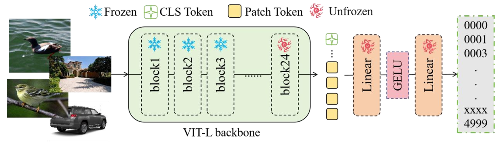
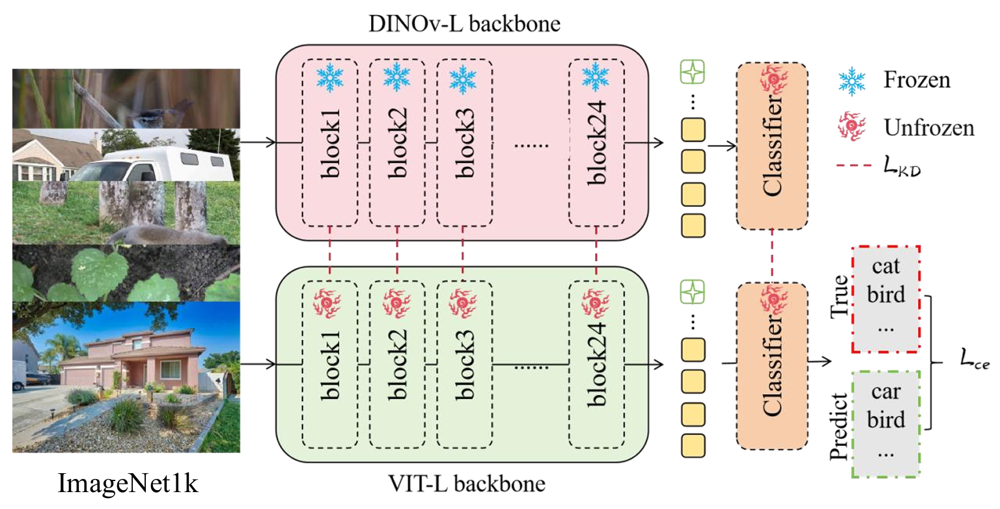

# AIC Project

[](LICENSE)
[](https://www.python.org/)
[](https://pytorch.org/)

Official implementation of the AIC project for fine-grained image classification.

## 🎯 Method Overview



## 🛠️ Installation

### Prerequisites
- NVIDIA GPU + CUDA
- Python 3.10
- PyTorch 2.8+

### Environment Setup

```bash
# Clone repository (if applicable)
# git clone [repository-url]
# cd AIC

# Create and activate conda environment
conda create -n aic python=3.10
conda activate aic

# Install PyTorch with CUDA support
pip install torch==2.8.0 torchvision==0.23.0 torchaudio==2.8.0 --index-url https://download.pytorch.org/whl/cu128

# Install other dependencies
pip install -r requirements.txt

# Install transformers
cd transformers
pip install .[torch]
cd ../
```

## 📊 Data Preparation

### Dataset Structure
Download datasets from official sources and organize them as follows:

```bash
# WebFG-400 dataset
AIC/data/webfg400/
├── train/          # Original training data
└── test_X/         # Test data splits

# WebFG-5000 dataset  
AIC/data/webfg5000/
├── train/          # Original training data
└── test_X/         # Test data splits
```

## 🔧 Data Processing Pipeline

### Step 1: Data Cleaning
```bash
# Clean WebFG-400 dataset
python data_cleaner.py \
    --raw_path ./data/webfg400/train \
    --refined_path ./data/webfg400/threshold/refined \
    --discard_path ./data/webfg400/threshold/discard \
    --mode threshold \
    --n 20 \
    --batch_size 8 \
    --device cuda:0 \
    --threshold 0.5

# Clean WebFG-5000 dataset
python data_cleaner.py \
    --raw_path ./data/webfg5000/train \
    --refined_path ./data/webfg5000/threshold/refined \
    --discard_path ./data/webfg5000/threshold/discard \
    --mode threshold \
    --n 20 \
    --batch_size 8 \
    --device cuda:0 \
    --threshold 0.8
```

### Step 2: Train-Validation Split
```bash
# Split WebFG-400 dataset
python data_splite.py \
    --raw_dir ./data/webfg400/threshold/refined \
    --train_dir ./data/webfg400/threshold/train \
    --val_dir ./data/webfg400/threshold/val \
    --split_ratio 0.8

# Split WebFG-5000 dataset
python data_splite.py \
    --raw_dir ./data/webfg5000/threshold/refined \
    --train_dir ./data/webfg5000/threshold/train \
    --val_dir ./data/webfg5000/threshold/val \
    --split_ratio 0.8
```

## 🎯 Model Training

### Pretrained Weights Preparation
1. Download ImageNet-1K pretrained backbone weights from [Proteus-pytorch](https://github.com/BeSpontaneous/Proteus-pytorch)
2. Place the weights file as `weight/backbone-l.pth` (large version)
3. Generate pre-trained weights:

```bash
cd code
python get_weight.py
```

### Model Training
```bash
cd code

# Train on WebFG-400 dataset
python train.py \
    --model_name SimpleNet \
    --batch_size 64 \
    --lr 0.0005 \
    --epochs 100 \
    --val_steps 0 \
    --experiment_name webfg400 \
    --train_dir ../data/webfg400/threshold/train \
    --val_dir ../data/webfg400/threshold/val \
    --device 'cuda:0'

# Train on WebFG-5000 dataset
python train.py \
    --model_name SimpleNet \
    --batch_size 1024 \
    --lr 0.0005 \
    --epochs 50 \
    --val_steps 0 \
    --experiment_name webfg5000 \
    --train_dir ../data/webfg5000/threshold/train \
    --val_dir ../data/webfg5000/threshold/val \
    --device 'cuda:0'
```

## 📈 Inference

### Generate Predictions
```bash
cd code

# Predict on WebFG-400 test set
python predict.py \
    --model_path ../log/outputs/webfg400/best_model.pth \
    --class_mapping ../log/outputs/webfg400/class_mapping.json \
    --test_dir ../data/webfg400/test_A \
    --output_csv ../log/results/pred_results_web400.csv \
    --batch_size 64 \
    --device 'cuda:0'

# Predict on WebFG-5000 test set
python predict.py \
    --model_path ../log/outputs/webfg5000/best_model.pth \
    --class_mapping ../log/outputs/webfg5000/class_mapping.json \
    --test_dir ../data/webfg5000/test_A \
    --output_csv ../log/results/pred_results_web5000.csv \
    --batch_size 64 \
    --device 'cuda:0'
```

## 📁 Project Structure
```
AIC/
├── data/                    # Dataset directories
│   ├── webfg400/
│   └── webfg5000/
├── code/                    # Source code
├── weight/                  # Model weights
├── log/                     # Training logs and results
│   ├── outputs/
│   └── results/
└── requirements.txt         # Dependencies
```

## 📄 License
This project is licensed under the Apache License 2.0 - see the LICENSE file for details.